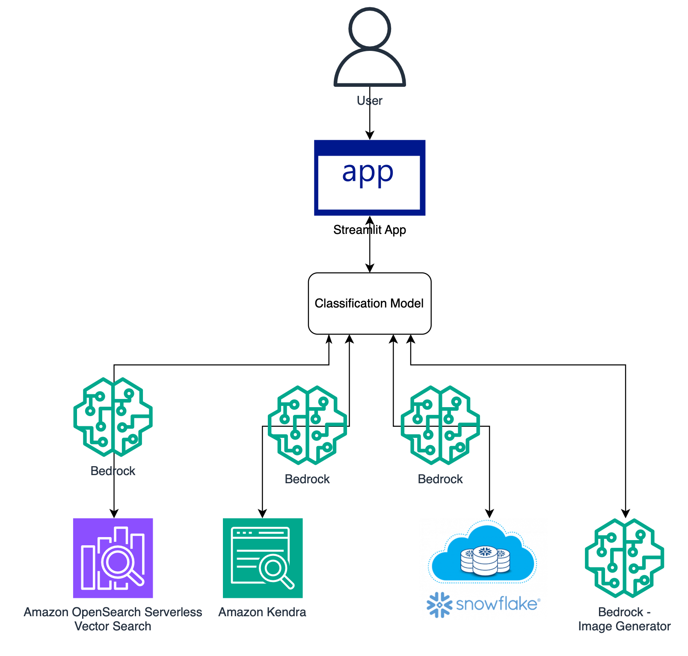

# Amazon-Bedrock-Multi-Model-Classification-Architecture
This is sample code demonstrating the use of Amazon Bedrock and Generative AI to implement a multi-model micro-services oriented architecture. The application is constructed with a simple streamlit frontend where users can input zero shot queries to satisfy a broad range of use cases against multiple disparate datasources.

# **Goal of this Repo:**
The goal of this repo is to provide users the ability to use a classification model, along with Amazon Bedrock to implement a multi-model micro-services oriented architecture, that leverages several Gen AI Applications through a single chat interface.
This repo comes with a basic frontend to help users stand up a proof of concept in just a few minutes.

The architecture and flow of the sample application will be:

